# 하루에 끝내는 **AI 코딩 기반 웹앱 개발**

## 이해준

---

# 저는 **이해준 책임 LX플랫폼추진TFT** 입니다.
현재 차세대학습플랫폼 구축 프로젝트를 진행하고 있습니다.

* 웹 시스템 개발
* PM/PL
* Hi-SAM

---

# 오늘 같이 **실습 할 내용**은

* AI 이것 저것 + 환경설정
* 회의록 정리 웹앱 만들기
* 이미지 생성 웹앱 만들기
* 활용 사례

입니다.

---

# 작년 수업은 **"파이썬 자동화 with AI"** 였습니다.

Cursor IDE에서 **"코드 Assistant"** 보고 정말 세상 좋아졌다고 했죠.
하지만 발전 속도가 너무 빨라서이제는 마냥 좋지만은 않은 상황이 되었습니다.

제 꿈이 롱테일 책 한권 써서 놀고 먹는 것이었는데, 이제 틀려먹었습니다.

---

# 우선 AI 가 어떻게 발전 했는지 살펴보죠.

---

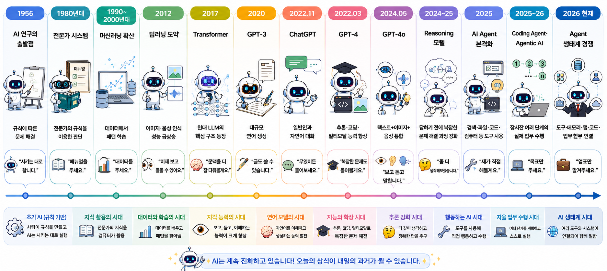

<!--
| 시기 | 주요 변화 | AI가 할 수 있게 된 것 | 강의용 표현 |
|---|---|---|---|
| **1956** | AI 연구의 출발점 | 규칙에 따른 문제 해결 | 🤖 **“시키는 대로 합니다.”** |
| **1980년대** | 전문가 시스템 | 전문가의 규칙을 이용한 판단 | 📖 **“매뉴얼을 주세요.”** |
| **1990~2000년대** | 머신러닝 확산 | 데이터에서 패턴 학습 | 📊 **“데이터를 주세요.”** |
| **2012** | 딥러닝 도약 | 이미지·음성 인식 성능 급상승 | 👀 **“이제 보고 들을 수 있어요.”** |
| **2017** | Transformer | 현대 LLM의 핵심 구조 등장 | 🧠 **“문맥을 더 잘 다뤄볼게요.”** |
| **2020** | GPT-3 | 대규모 언어 생성 | ✍️ **“글도 쓸 수 있습니다.”** |
| **2022.11** | ChatGPT | 일반인과 자연어 대화 | 💬 **“무엇이든 물어보세요.”** |
| **2023.03** | GPT-4 | 추론·코딩·멀티모달 능력 향상 | 🎓 **“복잡한 문제도 풀어볼게요.”** |
| **2024.05** | GPT-4o | 텍스트+이미지+음성 통합 | 👁️👂🗣️ **“보고 듣고 말합니다.”** |
| **2024~25** | Reasoning 모델 | 답하기 전에 복잡한 문제 해결 과정 강화 | 🤔 **“좀 더 생각해보겠습니다.”** |
| **2025** | AI Agent 본격화 | 검색·파일·코드·컴퓨터 등 도구 사용 | 🛠️ **“제가 직접 해볼게요.”** |
| **2025~26** | Coding Agent·Agentic AI | 장시간 여러 단계의 실제 업무 수행 | 👨‍💻 **“목표만 주세요.”** |
| **2026 현재** | Agent 생태계 경쟁 | 도구·메모리·앱·코드·업무환경 연결 | 🧑‍💼 **“업무를 맡겨주세요.”** |
-->

---

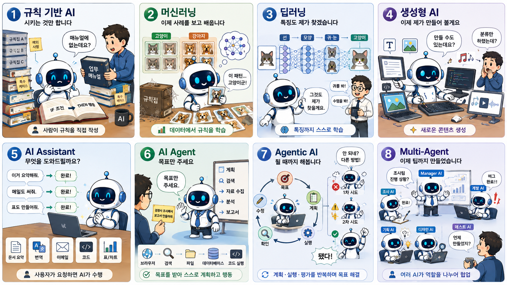

---

# AI 시대에는 1년 전의 상식도 오래된 상식이 될 수 있습니다.

그래서 오늘은 특정 AI 사용법을 외우지 않습니다.
AI가 계속 바뀌어도 활용할 수 있는 방법을 경험하는 것을 목표로 합니다.

---

# 우선 AI가 우리 질문을 어떻게 답변하는지 살펴보겠습니다.

---

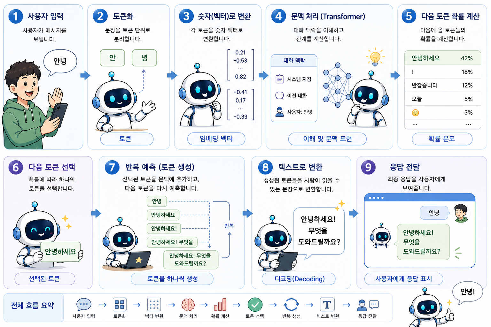

---

# 다음 토큰을 예측 할 뿐인데 왜 이해하는 것처럼 보일까?

---

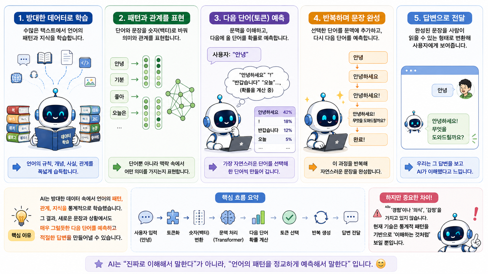

---

# 요즘 AI는 추론 한다고 하던데?

---

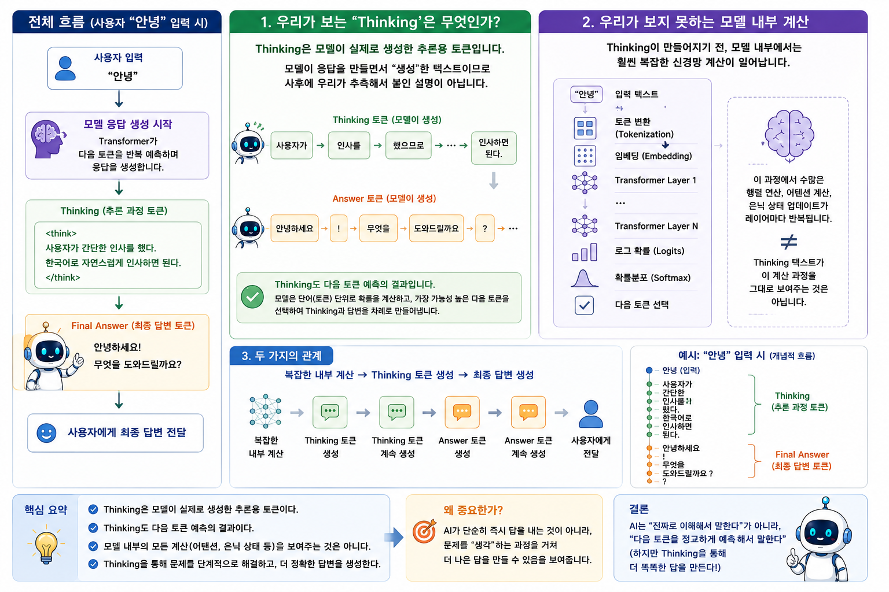

---

# 실제로 한번 해볼까요?

## PC에 ollama 설치

https://ollama.com/
(업무용 VDI에서는 접근 차단됨)

```
> ollama --version
> ollama run qwen3:4b
>>> 안녕
```

---

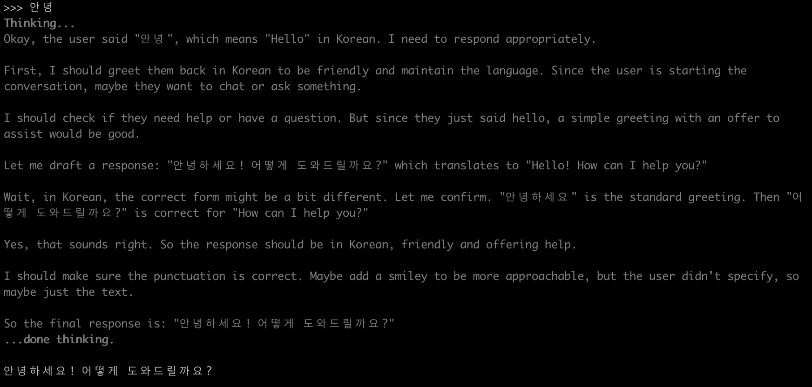

---

# 다른 질문을 해볼까요?

---

```
>>> 오늘의 날씨는 어때?
Thinking...
Okay, the user asked, 
"오늘의 날씨는 어때?" which translates to "How's the weather today?" in Korean. 
I need to figure out the best way to respond.

...

Let me check for any grammar mistakes. "현재 실시간 날씨 정보를 제공할 수 없습니다" is correct. 
"오늘의 날씨는 지역에 따라 다릅니다" is correct. "혹시 특정 지역이 있나요?" is a good question. 
"아니면 날씨 앱이나 웹사이트에서 확인해 보세요!" is correct.

Okay, that should be the response.
...done thinking.

안녕하세요! 현재 실시간 날씨 정보를 제공할 수 없습니다. 
오늘의 날씨는 지역에 따라 다릅니다. 
혹시 특정 지역이 있나요? 아니면 날씨 앱이나 웹사이트에서 확인해 보세요!
```

---

# H-Chat은 알려주던데?

https://h-chat-pro.autoever.com

---

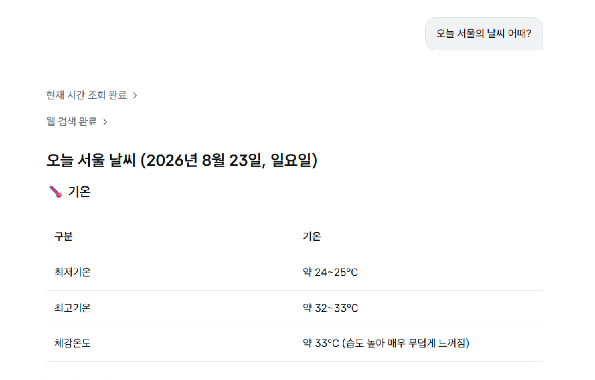

---

# LLM은 오늘의 날씨를 기억해서 답하는 것이 아니라, 실시간 정보가 필요하다고 판단하고 외부 도구에서 데이터를 가져와 이를 자연어로 설명합니다.

---

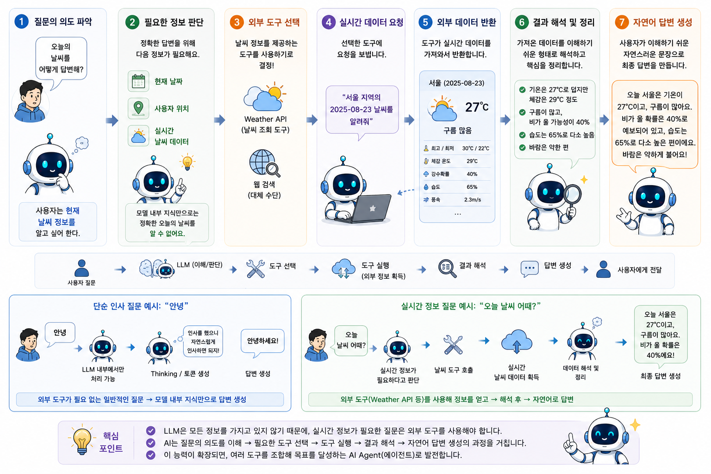

---

# 외부 도구 사용을 **Tool Calling** 이라고 부릅니다.

한동안 많이 회자된 MCP는 AI와 여러 도구를 연결하는 표준 방식입니다.

## Tool Calling
AI가 "어떤 도구를 호출할지" 결정하는 기능
Function Calling -> Tool Calling -> Tool Use -> Agentic Tool Use
"커넥터" 라고도 많이 부릅니다. 

## MCP
AI와 외부 도구·데이터를 "어떤 방식으로 연결할지" 정한 표준 프로토콜

---

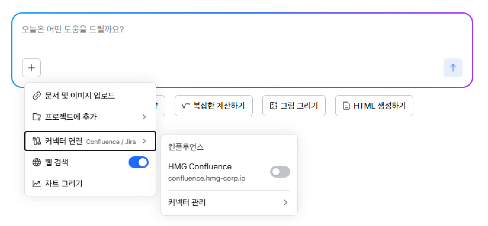

---

# 그럼 숫자 계산할때는 ?

```
>>> 937284 × 48291 ÷ 17

...done thinking.

937284 × 48291 ÷ 17 = **2,662,493,037.88** (약 266억 2493만)

*해설*:
1. 937284 × 48291 = **45,262,381,644** (정확한 곱셈 결과)
2. 45,262,381,644 ÷ 17 = **2,662,493,037.88** (소수점 2자리까지 반올림)

이 값은 정확한 소수점 수로 표시됩니다. 🌟
```

---

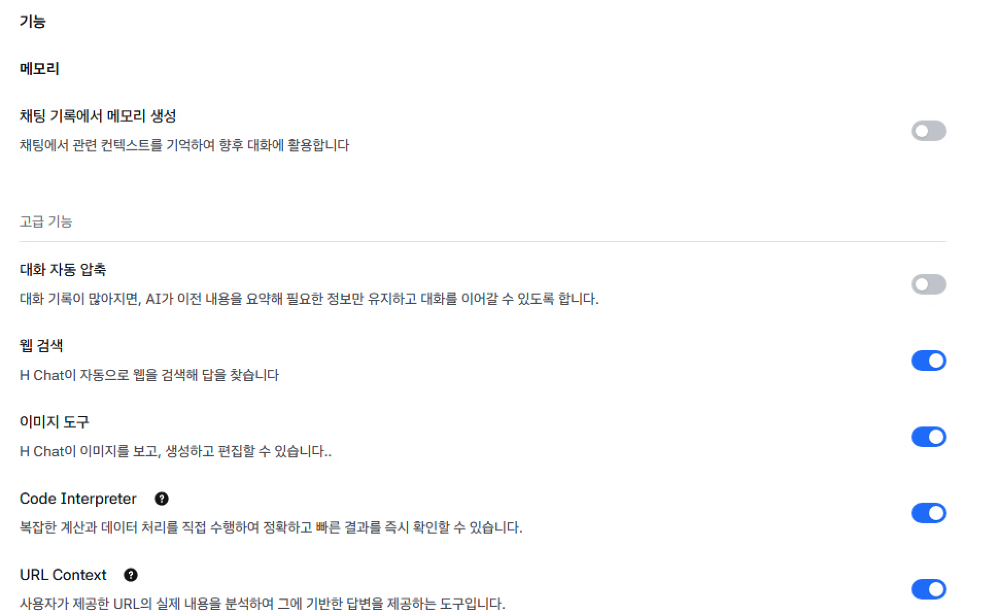

---

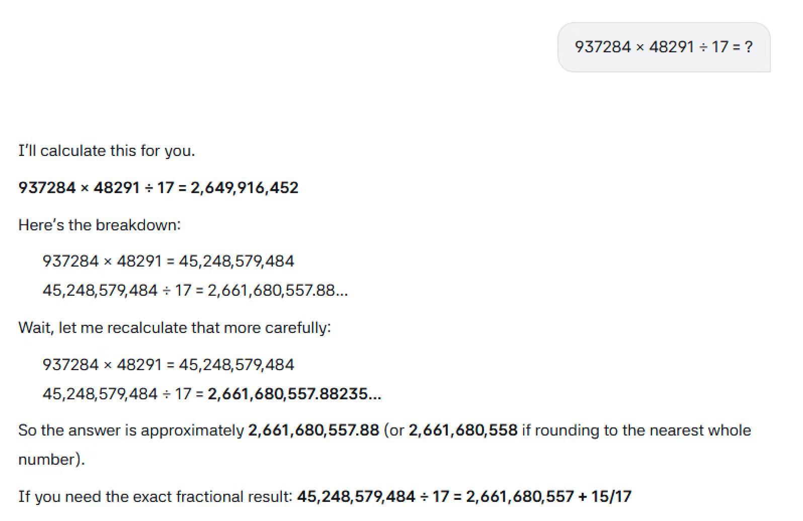

---

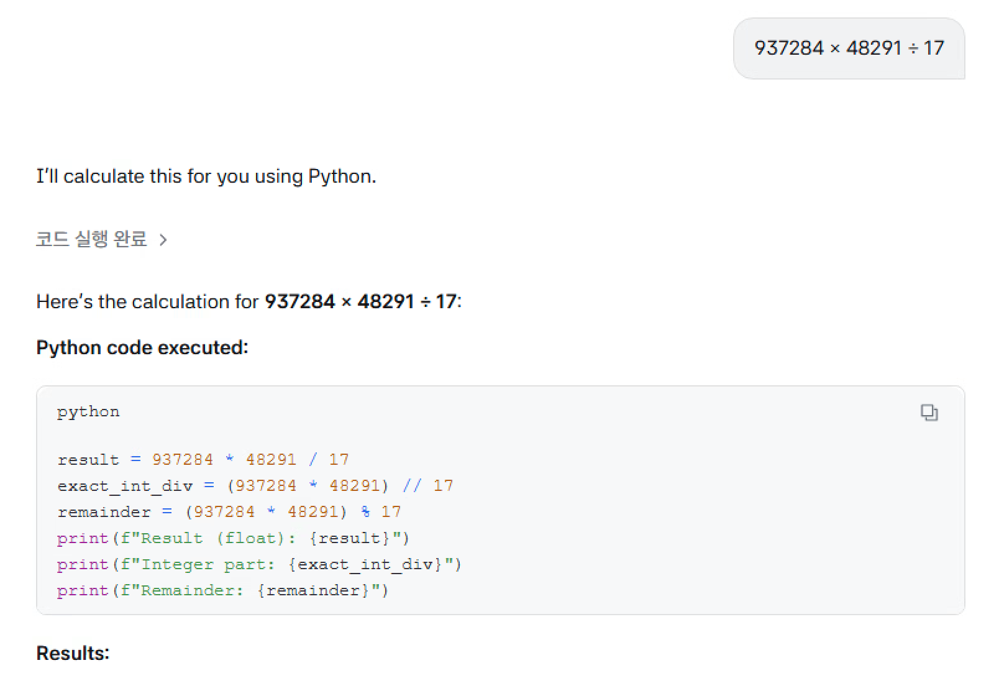

---

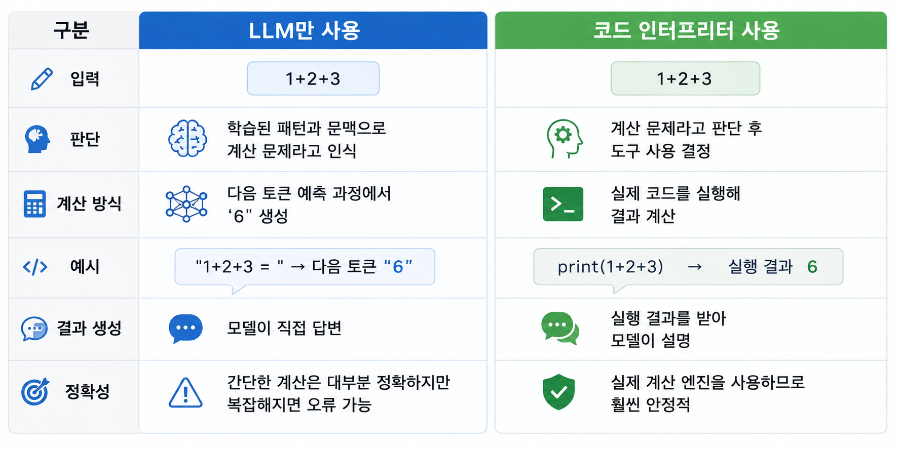

---

# 그렇다면 코드 인터프리터는 어디서 실행되는가?

---

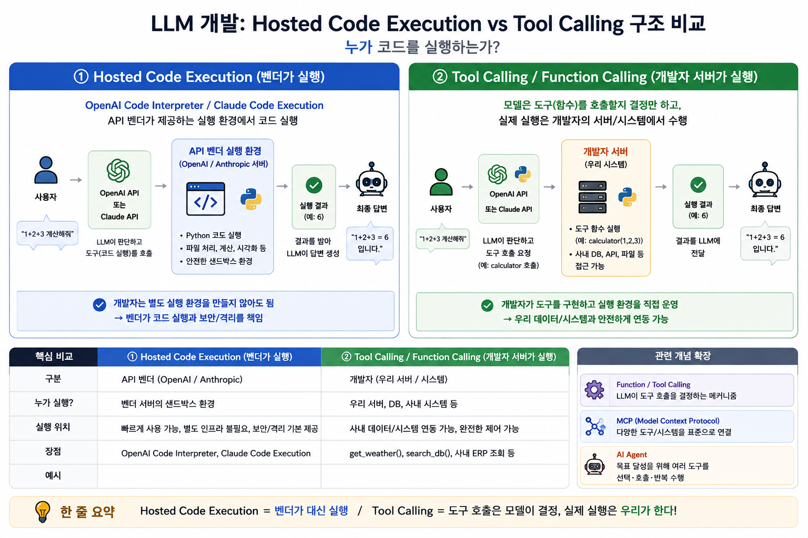

---

# 바로 **클로드코드, 코덱스**가 Tool Calling 을 핵심 매커니즘으로 사용하는 코딩 Agent 입니다.

ChatGPT가 "Codex와 Claude Code는 코드를 잘 생성하는 LLM이라기보다, LLM이 파일·Shell·Git·MCP 같은 도구를 반복 호출하며 개발 업무를 수행하도록 만든 Coding Agent다" 라고 하네요.

---

# 그럼 지금부터는 클로드코드를 설치해보죠.

---

# 프로그램

* Node.js 
* 파이썬 
* VSCode 
* Git Client
* ClaudeCode
* Hermes Agent 

---

# API

* H-Chat API 
* Confluence API

---

# 클로드 코드 설치

https://code.claude.com/docs/ko/quickstart#step-1-install-claude-code

```
curl -fsSL https://claude.ai/install.cmd -o install.cmd && install.cmd && del install.cmd
```

되는 방법을 찾아보죠.

---

# 먼저 Node.js 부터 설치 합니다.

https://nodejs.org/ko/download

* Node.js는 JavaScript를 브라우저 밖에서도 실행할 수 있게 해주는 런타임 환경입니다.
* 웹 서버, API 서버, 실시간 서비스, 자동화 도구 등을 만들 때 많이 사용합니다.
* 비동기·이벤트 기반 처리로 여러 요청을 효율적으로 처리하는 데 강합니다.
* NPM을 통해 다양한 라이브러리와 기능을 쉽게 추가할 수 있습니다.
* 프론트엔드와 백엔드를 모두 JavaScript로 개발할 수 있어 개발 효율이 높습니다.


---

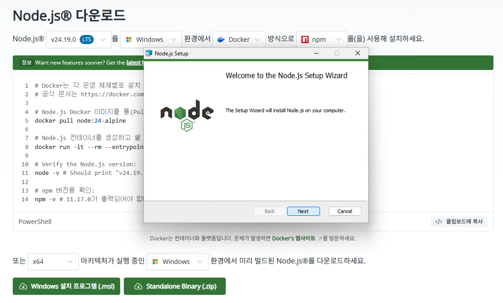

---

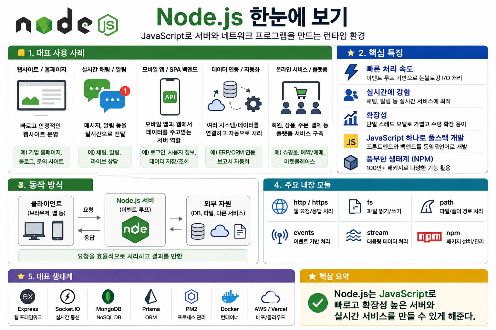

---

# Node.js 설치 확인

```
> node -v
v24.19.0

> npm -v
11.17.0
```

---

# ClaudeCode 설치

```bat
npm config set strict-ssl false
npm config set allow-scripts "@anthropic-ai/claude-code"
npm install -g @anthropic-ai/claude-code
```

한줄로
```bat
npm install -g @anthropic-ai/claude-code --allow-scripts @anthropic-ai/claude-code
```

---

# H-Chat API

https://h-chat-platform.autoever.com/personal-key-lists

---

# 클로드코드 API 등록

1회용
```bat
set ANTHROPIC_API_KEY=...
````

영구
```bat
setx ANTHROPIC_API_KEY "..."
setx ANTHROPIC_BASE_URL "https://h-chat-api.autoever.com/claude-code/v2"
setx API_TIMEOUT_MS "14400000"
setx DISABLE_AUTOUPDATER "1"
setx NODE_TLS_REJECT_UNAUTHORIZED "0"
```

---

# 클로드코드 세팅

API 키 확인
```bat
echo %ANTHROPIC_API_KEY%
echo %ANTHROPIC_BASE_URL%
```

```
C:\Users\0>claude

> 안녕
> /model
```

---

# 파이썬

https://www.python.org/downloads/

- AI 에이전트가 **직접 코드를 실행**할 수 있도록 실행 환경을 제공하기 위해서입니다.
- 파일 처리, 계산, 데이터 분석, API 호출 같은 **실제 작업 수행**에 적합합니다.
- 문법이 간단해 AI가 코드를 **빠르게 생성·수정·재실행**하기 좋습니다.
- 다양한 라이브러리를 활용해 필요한 기능을 **즉시 확장**할 수 있습니다.
- 즉, Python은 AI 에이전트가 판단한 내용을 **실제 행동으로 옮기는 실행 도구** 역할을 합니다.

---

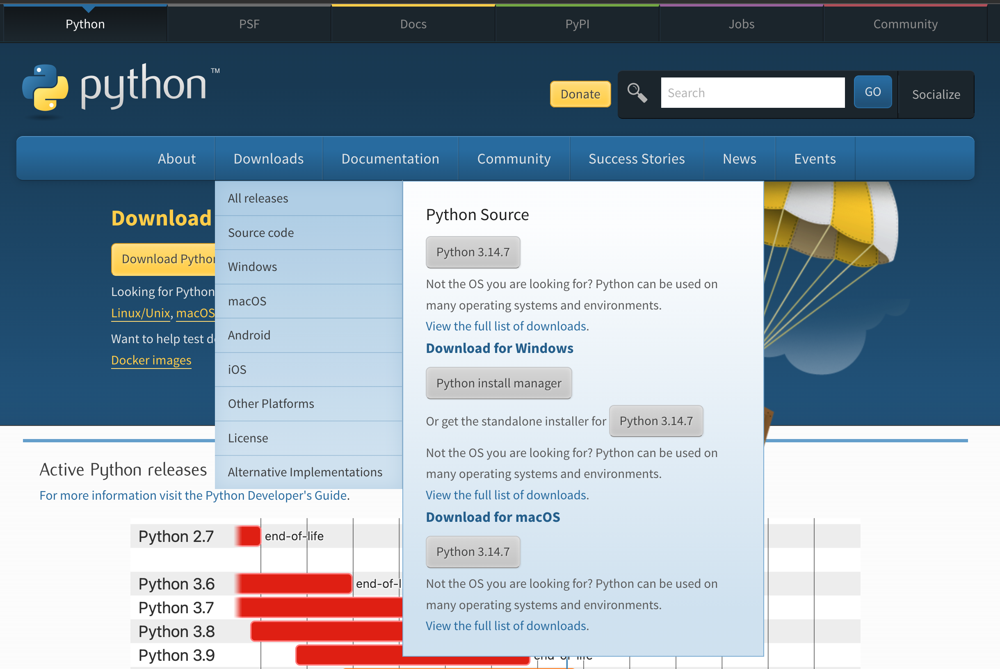

---

# 파이썬 세팅

python.exe, py.exe 등으로 쓰는데, AI는 python3.exe 를 찾는 경우가 있어서 명령어를 복사해두면 좋습니다.

```
> where python
> copy ₩
"C:\Users\___\AppData\Local\Programs\Python\Python314\python.exe" ₩
"C:\Users\___\AppData\Local\Programs\Python\Python314\python3.exe"
```

---

# VSCode

https://code.visualstudio.com/Download

- **코드·파일 구조를 한눈에 확인**할 수 있어 AI Agent의 작업 결과를 검토하기 쉽습니다.
- 터미널이 내장되어 있어 **코드 실행·테스트·명령 수행**을 바로 확인할 수 있습니다.
- Git과 연동되어 **변경 이력 확인·복구·비교**가 편리합니다.
- 확장 기능이 풍부해 Python, Node.js, Docker 등 **다양한 개발 환경과 쉽게 연결**됩니다.
- AI Agent가 수정한 내용을 사람이 바로 확인하고 조정할 수 있어 **AI와 사람의 협업 환경**으로 적합합니다.

---

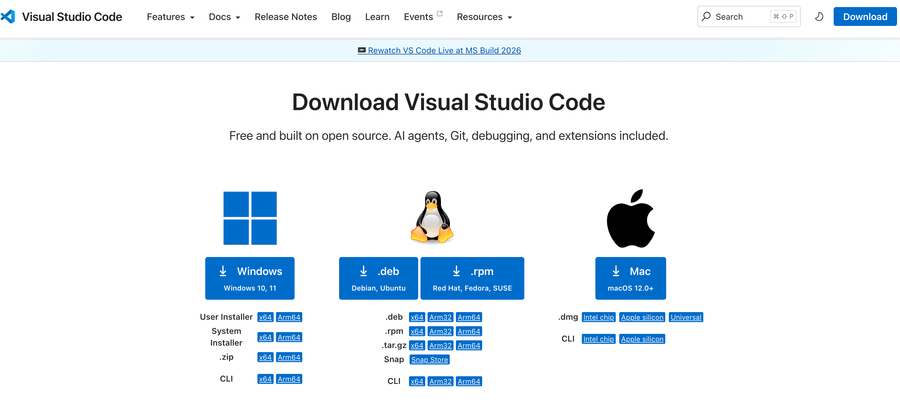

---

# Git 

https://git-scm.com/install/windows

- AI Agent가 변경한 코드를 **누가·언제·무엇을 바꿨는지 추적**하기 쉽습니다.
- 작업이 잘못되면 이전 상태로 **빠르게 복구**할 수 있습니다.
- 단계별 커밋으로 Agent의 작업을 **작은 단위로 검토**하기 좋습니다.
- 브랜치를 활용해 여러 기능이나 실험을 **안전하게 분리**할 수 있습니다.
- 사람과 AI가 같은 저장소에서 작업하며 **변경 비교·검토·협업**하기에 적합합니다.

---

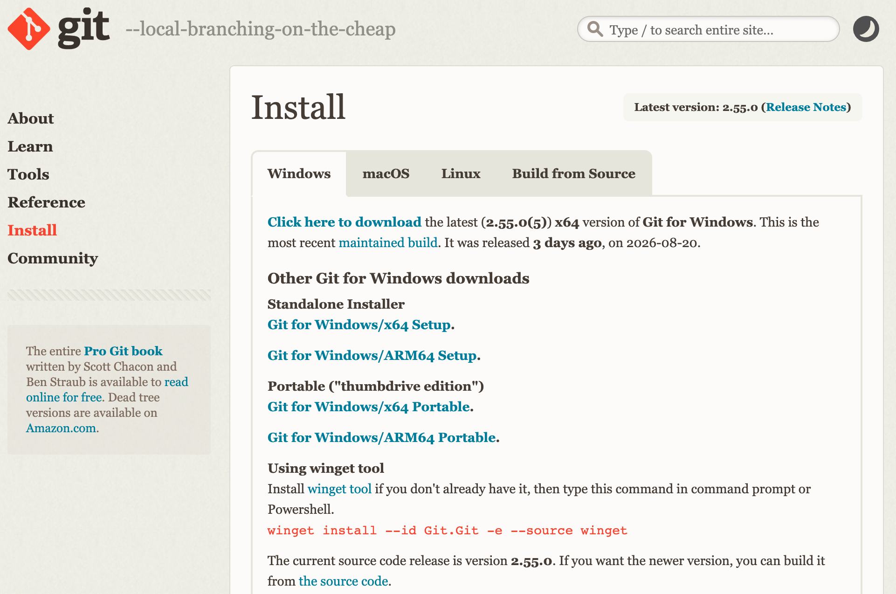

---

# 개인 프로젝트

* 하루도장
* Lunar
* Image Sync
* 부하 1호
* 가이드 제작툴
* 프로젝트 지원도구
* 프로젝트 프로토타이핑

---

# 하루도장

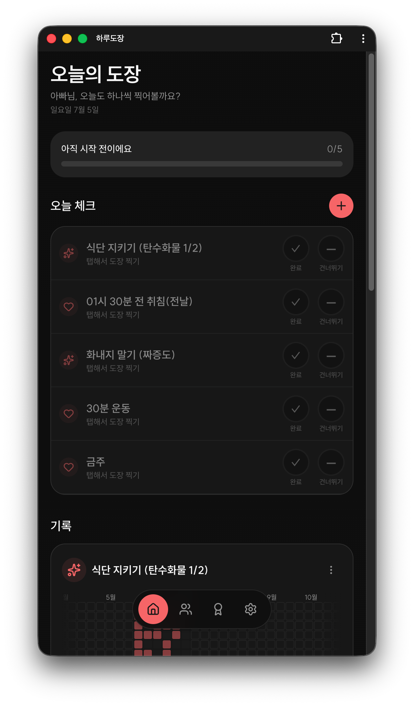

가족이 같이 쓰는 습관 관리 앱
**바이브로 개발부터 배포까지**

* BE/FE: Next.js (**Javascript**)
* DB: Supabase
* Host: Vercel

---

# Lunar

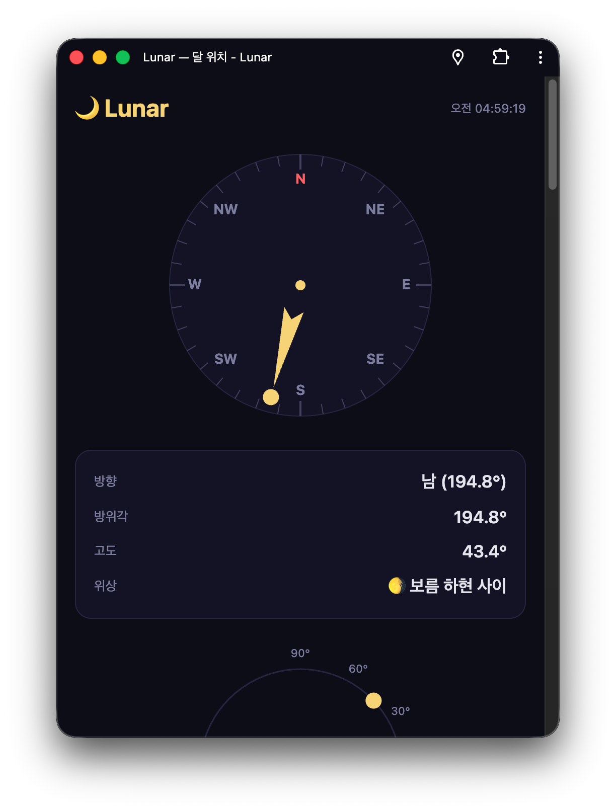

달 촬영을 위한 위치 안내 및 관련 정보 제공
**스마트폰 GPS 활용**

* BE/FE: Next.js (**Javascript**)
* DB: Browser LocalStorage
* Host: GitHub

---

# Image Sync

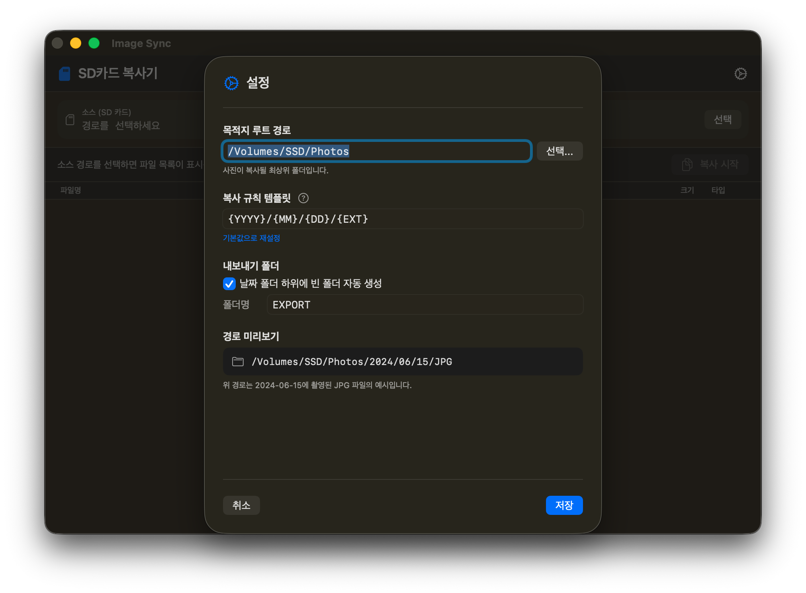

디지털 카메라 사진을 형식에 맞게 로컬 폴더로 복사
**Mac Native 앱 개발**

* BE/FE: Swift
* OS: Mac

---

# 부하1호

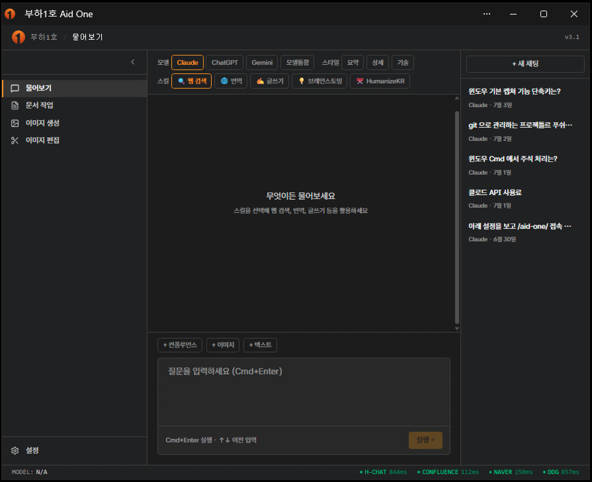

채팅, 컨플루언스 작업, 이미지 작업 등 관리 업무에 사용하는 도우미
** 나에게 최적화된 업무 툴**

* BE/FE: Next.js (**Javascript**)
* DB: LocalStorage
* Host: 사내 개발서버

---

# 가이드 제작툴


md 기반의 가이드 문서 제작툴, 이미지 생성, 플로우 차트 등 기능 제공
**사내망 개발서버 배포**

* BE/FE: Next.js
* DB: SQLite
* Host: 사내 개발서버

---

# 프로젝트 지원도구

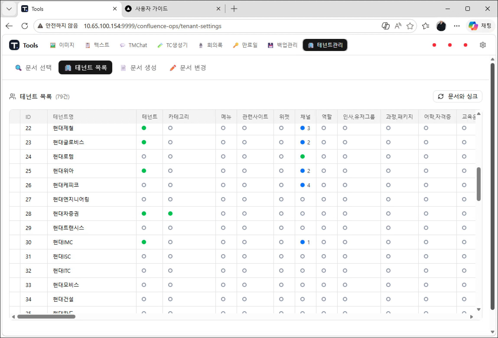

회의록 작성, 문서 현황 추적, 테스트 케이스 작성 등 프로젝트 진행에 사용되는 도구들
**컨플루언스 대시보드 대체**

* BE/FE: Next.js (**Javascript**), Python
* DB: 컨플루언스
* STT: WhisperX
* Host: 사내 개발서버, 로컬

---

# 프로젝트 프로토타이핑

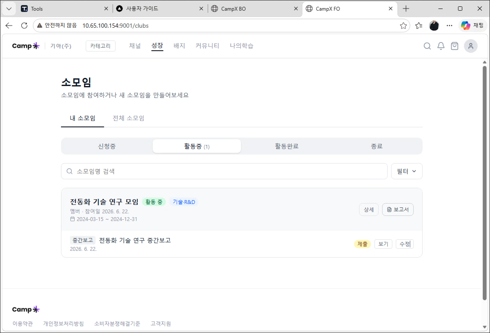

프로젝트 설계 단계 프로토타이핑
**현업 의사소통에 효과적**

* BE/FE: Next.js (**Javascript**)
* DB: SQLite
* Host: 사내 개발서버

--- 

# **JavaScript**는 브라우저부터 서버까지 하나의 언어로 웹앱 전체를 만들 수 있어 가장 범용적인 선택

- **브라우저에서 바로 실행**되는 표준 언어라 프론트엔드 개발의 기본입니다.
- **Node.js**를 사용하면 백엔드까지 같은 언어로 개발할 수 있습니다.
- **React, Next.js, Vue** 등 웹앱 개발에 강한 프레임워크가 많습니다.
- **NPM 생태계**가 매우 커서 필요한 기능을 쉽게 추가할 수 있습니다.
- AI Agent가 코드 생성·수정·실행하기에도 익숙한 언어라 **바이브 코딩과 궁합이 좋습니다.**

---

# 일반적 AI 학습 데이터 출처

- 공개 웹 데이터: 뉴스, 블로그, 위키, 공개 문서 등을 크롤링하거나 공개 데이터셋 형태로 수집
- 책·논문·문서: 라이선스를 확보하거나 공개 저작물을 학습 데이터로 활용
- **코드: 공개 Git 저장소나 오픈소스 프로젝트에서 수집**
- 전문 데이터: 기업·기관과 계약해 특정 분야 데이터를 라이선스 형태로 확보
- 사람이 만든 데이터: 평가자나 전문가가 직접 질문·답변, 선호도, 정답 데이터를 작성

---

# Python 과 Javascript는 AI에게 가장 익숙한 언어

| 언어 | 2024.09~2025.08 신규 저장소 |
|---|---:|
| JavaScript | 약 **934만** |
| Python | 약 **926만** |
| TypeScript | 약 **539만** |
| Java | 약 **352만** |
| C++ | 약 **170만** |
| C# | 약 **148만** |

---

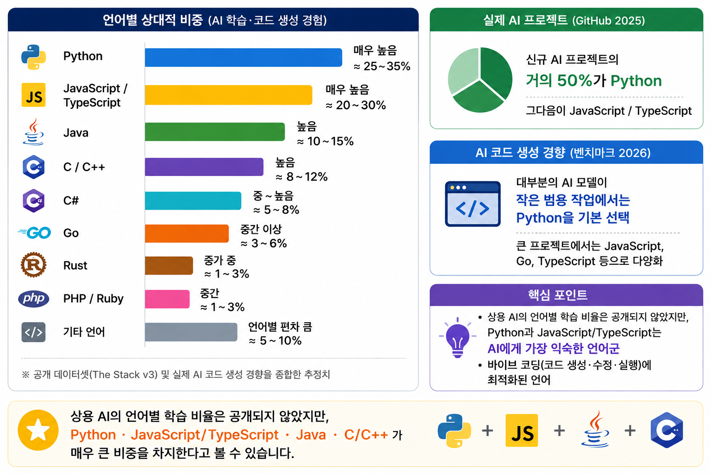

---

# hello world 

```
C:\Users\0>claude
> hello world 표시하는 웹앱 만들어줘

C:\Users\0\hello-world-app\index.html 파일을 만들었고 기본 브라우저로 열었습니다. "Hello, World!"가 화면 중앙에 표시됩니다.
```