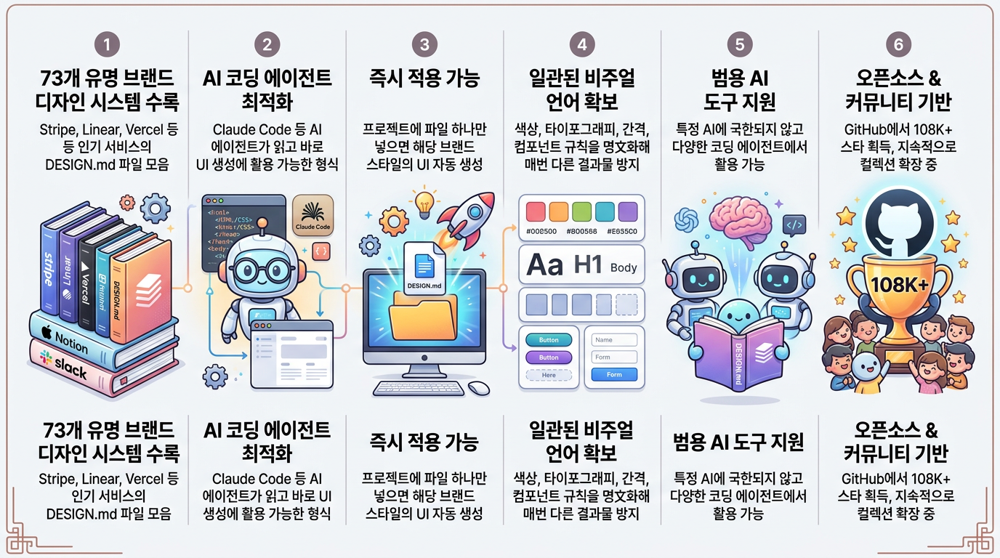
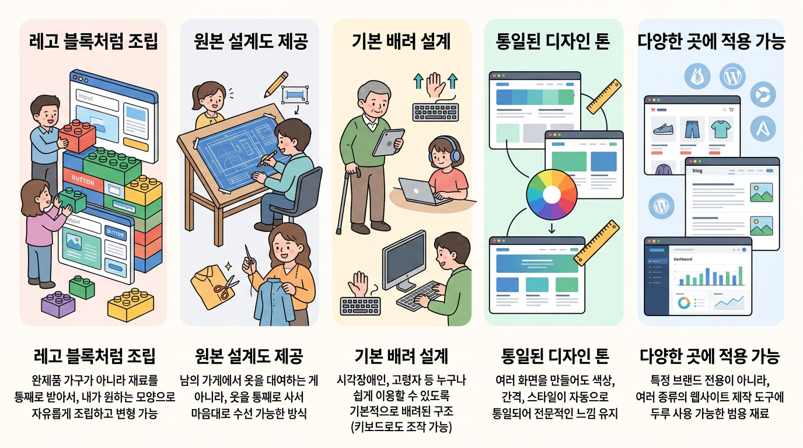

# 회의록 정리 웹앱

## 텍스트로 정리된 회의록 녹취 문서를 회의록 형태로 변환하는 개인용 웹앱을 만듭니다.

---

# 프로젝트 폴더 만들기

ClaudeCode는 프로젝트를 디렉토리 단위로 관리합니다. 
1. 프로젝트를 위해 새로운 폴더를 생성합니다.
1. 프로젝트 폴더에서 claude를 실행합니다.

```
C:\Users\0\Projects\meeting>claude
```

---

# 클로드코드 치트시트

https://support.claude.com/ko/articles/14553413-claude-code-%EC%B9%98%ED%8A%B8%EC%8B%9C%ED%8A%B8

용어집, 명령어, 단축키 등을 확인할 수 있습니다.

---

# 요구사항

```
❯ 회의 내용을 기록한 text 파일을 읽어서 회의록 형태로 변환하는 웹앱을 만들꺼야. 요구사항 초안을 만들어줘

회의록 변환 웹앱의 요구사항 초안을 작성하기 전에, 설계에 큰 영향을 주는 몇 가지를 먼저 확인할게요.

● User answered Claude's questions:
· 회의 내용을 회의록 형태로 '변환'할 때 어떤 방식을 쓸까요? → LLM API 활용 (추천)
· 웹앱은 어떤 환경에서 동작해야 하나요? → 로컬 실행 (개인/사내용)
· 완성된 회의록은 어떤 형태로 받고 싶으신가요? → 화면에서 바로 확인/편집, Markdown/텍스트 다운로드
```

---

# 문서로 저장

```
❯ 정리된 내용을 docs 아래 문서로 남겨줘
 Do you want to create requirements.md?
   1. Yes
   2. Yes, and switch to accept edits 
   (auto-approve file edits and common file commands) for this session (shift+tab)
   3. No
```

---

# 클로드코드 권한 모드

Shift + Tab 으로 모드 변경

| 모드 | 설명 | 위험도 |
|---|---|---|
| Default | 매 작업마다 승인 요청 | 낮음 (안전) |
| Auto-Accept Edits | 파일 편집 자동 승인, 명령 실행은 확인 필요 | 중간 |
| Plan Mode | 읽기 전용, 실행/수정 없이 계획만 수립 | 없음 (안전) |
| Bypass Permissions | 모든 권한 확인 생략 | 높음 |

Auto 모드를 권장하는데, Opus 모델 사용 때문에 동작하지 않는다면 Bypass 모드를 사용해야합니다.

---

# Bypass 모드 활성화 방법

C:\Users\0\.claude\settings.json
```
  "permissions": {
    "defaultMode": "bypassPermissions"
  }
```

---

# 이어서 작업할 때

```
❯ 작업 이어하자
메모리에 이전 대화 기록이 없고, 프로젝트 디렉토리에 docs/design.md와 docs/requirements.md만 있네요. 두 파일을 확인해서 어떤 작업이었는지 파악하겠습니다.
```

```
C:\Users\0\Projects\meeting>claude

Resume this session with:
claude --resume 9c85654d-fb05-4ad1-b829-ccb9fe00cc49
```

---

# 진행상황 문서로 남기기

```
❯ 모든 작업은 진행상황을 문서로 남겨두고, 세 새션이 시작되면 해당 문서를 읽고 시작하도록
설정해 docs 아래 문서를 확인해서 현재 상태를 리뷰해줘

설정 완료했습니다.

- docs/progress.md — 진행상황 로그 생성 (현재 단계, 완료 작업, 다음 할 일 체크리스트, 
  미확정 사항 포함)
- CLAUDE.md — 매 세션 자동 로드되는 파일에 "세션 시작 시 progress.md 먼저 읽기 / 
  작업 종료 시 progress.md 갱신" 규칙 명시
```
---

# CLAUDE.md 

- Claude Code가 프로젝트 진입 시 가장 먼저 읽는 컨텍스트 파일
- 프로젝트 규칙, 코딩 스타일, 워크플로우를 반복 설명 없이 영구 저장
- 주요 포함 내용: 프로젝트 구조, 코딩 표준, 자주 쓰는 명령어, 작업 규칙, 주의사항
- 위치: 프로젝트 루트(전역 적용) / 하위 디렉토리(세부 적용) / 글로벌(모든 프로젝트 공통)
- /init 명령어로 자동 생성 가능
- 단순 문서가 아닌 에이전트 작업 기준 지침서 역할
- 과도한 규칙 추가 시 성능 저하(Context Rot) 발생 → 간결하게 관리 필요

---

# 설계 수정

```
❯ 설계 내용 업데이트 하자.
  AI API는 https://h-chat-platform.autoever.com/docs/ko/api-spec/chat-api/claude 문서를 
  참고해

● Fetch(https://h-chat-platform.autoever.com/docs/ko/api-spec/chat-api/claude)
Error: Unable to verify if domain h-chat-platform.autoever.com is safe to fetch. 
This may be due to network restrictions or enterprise security policies blocking claude.ai.

WebFetch로는 이 사내 도메인(h-chat-platform.autoever.com)에 접근할 수 없습니다 
— 안전성 확인이 안 되는 내부망 URL이라 차단됩니다.

● User answered Claude's questions:
· h-chat-platform.autoever.com API 스펙을 제가 반영할 수 있도록 어떻게 전달해주시겠어요?
 → ! curl로 직접 조회
```

---

# ! 명령어 설명

Claude Code 내에서 셸(Bash) 명령어를 직접 실행하는 단축 문법

## 사용법

입력창에 ! 뒤에 명령어 입력 (예: !ls, !npm test)

## 특징 및 용도

* Claude에게 요청하지 않고 즉시 시스템 명령 실행
* 실행 결과가 대화 컨텍스트에 포함되어 이후 대화에 활용 가능
* 빠른 파일 확인, 테스트 실행, git 상태 체크 등
* AI 개입 없이 직접 터미널처럼 사용 가능

**대화 흐름을 끊지 않고 명령 실행 → 결과 확인 → 이어서 작업 가능**

---

# skill 사용

```
> C:\Users\0\Projects\vibe-coding\skills\h-chat-api 스킬을 참고하도록 설계 변경해
```

만약 C:\Users\0\.claude\skills 에 있다면,
```
> h-chat-api 참고하여 설계 변경해
```

---

# 기술 스택 검토

| 영역 | 선택 | 이유 |
|---|---|---|
| 프레임워크 | Next.js (App Router) | 프론트+백엔드(API Route)를 한 프로젝트로 해결, 로컬 실행 간단(`next dev`) |
| 언어 | TypeScript | 타입 안정성, LLM 응답 스키마 검증에 유리 |
| UI | React + 기본 CSS(또는 Tailwind) | 빠른 구현, 별도 디자인 시스템 불필요 |
| LLM 연동 | H-Chat API (사내 게이트웨이) | Claude를 사내망에서 별도 Anthropic 키 없이 호출. `h-chat-api` 스킬의 `client.ts`(의존성 없는 fetch 래퍼)를 `lib/hchat.ts`로 복사해 사용 |
| 환경변수 관리 | `.env.local` (`HCHAT_KEY`) | Next.js 표준 방식, git에 커밋되지 않음. 키는 90일 후 만료되므로 갱신 필요 |

---

# 상태를 되돌리고 싶다면?

```
> git 으로 형상 관리 시작

Git 형상 관리를 시작했습니다.

- git init으로 로컬 저장소 생성 (branch: master)
- .gitignore 추가 — 향후 Next.js 스캐폴딩 시 node_modules/, .next/, 
  .env.local(HCHAT_KEY 포함) 등이 커밋되지 않도록 미리 설정
- CLAUDE.md, docs/ 전체를 초기 커밋
```

---

# 개발

```
> 개발 진행해

Dev 서버가 정상 구동됐습니다. curl로 페이지와 API를 먼저 확인하겠습니다.

  Ran 1 shell command

페이지 로드, 유효성 검사, HCHAT_KEY 미설정 에러 처리까지 모두 의도대로 동작합니다. 
이제 브라우저에서 실제 UI 흐름을 확인하겠습니다.

● Skill(run)
Successfully loaded skill

  Read 1 file, ran 3 shell commands

Chromium이 설치되었습니다. 이제 스크립트로 브라우저를 직접 구동해 UI 흐름을 확인합니다.

✻ Worked for 10m 0s
```

---

# 있어 보이게! 디자인 정책 적용

https://github.com/VoltAgent/awesome-design-md.git

```
❯ UI 컴포넌트를 shadcn/ui 기반으로 변경하고,  
  C:\Users\1175811\Projects\awesome-design-md\design-md\apple\DESIGN.md 
  를 가져와서 프로젝트의 기본 디자인 셋으로 지정해.

shadcn/ui 기반으로 전환 + Apple DESIGN.md 토큰 적용은 Tailwind 설정, 
shadcn CLI 초기화, 컴포넌트 선정 등 아키텍처가 걸린 작업이라 플랜부터 잡겠습니다.
```

---

# Awesome DESIGN.md

- **73개 유명 브랜드 디자인 시스템 수록**: Stripe, Linear, Vercel 등 인기 서비스의 DESIGN.md 파일 모음
- **AI 코딩 에이전트 최적화**: Claude Code 등 AI 에이전트가 읽고 바로 UI 생성에 활용 가능한 형식
- **즉시 적용 가능**: 프로젝트에 파일 하나만 넣으면 해당 브랜드 스타일의 UI 자동 생성
- **일관된 비주얼 언어 확보**: 색상, 타이포그래피, 간격, 컴포넌트 규칙을 명文화해 매번 다른 결과물 방지
- **범용 AI 도구 지원**: 특정 AI에 국한되지 않고 다양한 코딩 에이전트에서 활용 가능
- **오픈소스 & 커뮤니티 기반**: GitHub에서 108K+ 스타 획득, 지속적으로 컬렉션 확장 중: 특정 브랜드 전용이 아니라, 여러 종류의 웹사이트 제작 도구에 두루 사용 가능한 범용 재료

---



---

# shadcn/ui

- **레고 블록처럼 조립**: 완제품 가구가 아니라 재료를 통째로 받아서, 내가 원하는 모양으로 자유롭게 조립하고 변형 가능
- **원본 설계도 제공**: 남의 가게에서 옷을 대여하는 게 아니라, 옷을 통째로 사서 마음대로 수선 가능한 방식
- **기본 배려 설계**: 시각장애인, 고령자 등 누구나 쉽게 이용할 수 있도록 기본적으로 배려된 구조 (키보드로도 조작 가능)
- **통일된 디자인 톤**: 여러 화면을 만들어도 색상, 간격, 스타일이 자동으로 통일되어 전문적인 느낌 유지
- **다양한 곳에 적용 가능**: 특정 브랜드 전용이 아니라, 여러 종류의 웹사이트 제작 도구에 두루 사용 가능한 범용 재료

---



---

# 컨플루언스 등록 기능 추가

```
❯ C:\Users\1175811\Projects\vibe-coding\skills\hmg-confluence 스킬을 참고해서
 HMG 컨플루언스에 등록하는 기능을 추가해
```

---

# 개인 스페이스가 조회되지 않으면?

```
❯  스페이스 조회 시 개인 공간은 조회가 되지 않아.

getSpaces()가 type=global로만 조회하고 있어서 개인 스페이스가 제외됐던 겁니다. 
필터를 제거해서 전체 타입을 조회하도록 고치겠습니다.

수정 완료하고 커밋했습니다 (edae8f4). 
개인 스페이스 포함 전체 목록이 정상 조회되는 것까지 실제 토큰으로 확인했습니다.
```