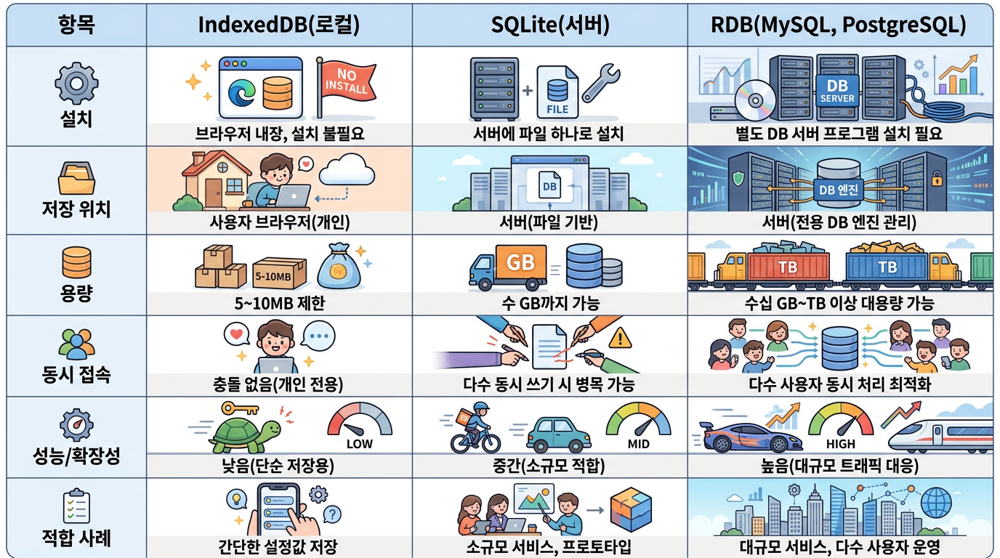

# 이미지 생성 앱

## 구글 제미나이 API를 이용해서 이미지를 생성하는 앱을 만듭니다.

---

# Superpowers 스킬

- **Superpowers**: AI 코딩 에이전트에게 "일하는 매뉴얼"을 주는 프레임워크
- **핵심 원리**: SKILL.md 문서로 AI의 작업 절차를 구체적으로 지정 (기획→개발→검토 등)
- **구성**: 브레인스토밍, TDD, 디버깅 등 14개 세부 스킬 포함
- **특징**: 필요한 정보를 단계적으로 제공하는 '점진적 공개' 방식 사용
- **효과**: 막연한 지시 대신 명확한 프로세스 부여 → 결과물 품질 향상
- **현황**: GitHub 트렌딩 1위, 새로운 AI 활용법으로 주목받는 중

---

# 플러그인 설치방법

https://github.com/obra/superpowers#claude-code

Register the marketplace:
```
/plugin marketplace add obra/superpowers-marketplace
```
Install the plugin from this marketplace:
```
/plugin install superpowers@superpowers-marketplace
```

---

# 요구사항

```
❯ 프롬프트를 입력 받아서 이미지를 생성하는 앱을 만들꺼야. 
사전에 정의된 스타일, 옵션등을 선택하면 이미지 품질이 유지될 수 있도록 해야해. 
요구사항을 문서로 정리해줘.

● Skill(superpowers:brainstorming)
Successfully loaded skill

● User answered Claude's questions:
· 이미지 생성은 어떤 방식으로 처리할 계획인가요? → 사내/내부 API 연동

● User answered Claude's questions:
· 사내 이미지 생성 API가 구체적으로 정해져 있나요? → H-Chat 게이트웨이 경유

● Skill(h-chat-api)
Successfully loaded skill
```

---

# 데이터 저장 방법

```
● User answered Claude's questions:
· Next.js 기반 BFF 구조(서버가 HCHAT_KEY를 보관하고 프록시, 
클라이언트는 IndexedDB로 이력 관리)으로 진행해도 될까요? → 네, 이 구조로 진행 (추천안)

스펙 문서를 작성했습니다: docs/superpowers/specs/2026-08-23-image-gen-app-design.md

문서 내용을 검토해주시고, 수정이 필요한 부분이 있으면 말씀해주세요. 
승인해주시면 다음 단계(구현 계획 수립)로 넘어갈 수 있습니다.

✻ Sautéed for 5m 52s
```

---



<!--
| 항목 | IndexedDB(로컬) | SQLite(서버) | RDB(MySQL, PostgreSQL) |
|------|------|------|------|
| 설치 | 브라우저 내장, 설치 불필요 | 서버에 파일 하나로 설치 | 별도 DB 서버 프로그램 설치 필요 |
| 저장 위치 | 사용자 브라우저(개인) | 서버(파일 기반) | 서버(전용 DB 엔진 관리) |
| 용량 | 5~10MB 제한 | 수 GB까지 가능 | 수십 GB~TB 이상 대용량 가능 |
| 동시 접속 | 충돌 없음(개인 전용) | 다수 동시 쓰기 시 병목 가능 | 다수 사용자 동시 처리 최적화 |
| 성능/확장성 | 낮음(단순 저장용) | 중간(소규모 적합) | 높음(대규모 트래픽 대응) |
| 적합 사례 | 간단한 설정값 저장 | 소규모 서비스, 프로토타입 | 대규모 서비스, 다수 사용자 운영 |
-->

---

# 디자인, UI 컴포넌트는 설계 단계 부터

웹앱은 Next.js + Shadcn/ui + DESIGN.md + IndexedDB를 기본으로,

필요에 따라 Python API 서버나 RDB 적용 검토

---

# 구현계획

```
❯ 커밋하고, 설계 진행해
커밋 완료했습니다 (b659ad0). 이제 승인된 스펙을 기반으로 구현 계획을 수립하겠습니다.

● Skill(superpowers:writing-plans)
Successfully loaded skill

● Write(~\Projects\image-gen\docs\superpowers\plans\2026-08-23-image-gen-app.md)

...

계획서를 docs/superpowers/plans/2026-08-23-image-gen-app.md에 저장하고 
커밋했습니다 (b772a5b).
8개 작업(스캐폴딩 → 스타일 프리셋 → 프롬프트 조합 → H-Chat 클라이언트 
→ API 라우트 → IndexedDB 이력 → 메인 UI → 갤러리 UI)으로 구성된 TDD 계획입니다.
```

---

# 구현

```
실행 방식을 선택해주세요.

1. Subagent-Driven (추천) — 작업마다 새 서브에이전트를 투입, 태스크 사이마다 리뷰
2. Inline Execution — 이 세션에서 직접 배치 실행, 체크포인트마다 검토

✻ Cooked for 6m 8s

❯ 1

● Skill(superpowers:subagent-driven-development)
Successfully loaded skill

현재 master 브랜치에서 바로 구현을 시작하지 않고, 격리된 워크트리를 만들어 진행하겠습니다.
```

---

# 프롬프트 = 업무 지시서

**나쁜 예**

> 보고서 작성해줘

**좋은 예**

> 다음 내용을 참고해서 보고서 작성해줘
> 신입사원 대상, A4 1장, 표 포함, Markdown 형식

---

# 좋은 프롬프트 요소 (1/2)

| 요소 | 의미 | 실제 예시 |
|---|---|---|
| **역할 (Role)** | AI가 어떤 관점·전문성을 가지고 답할지 지정 | `당신은 비전공자 대상 웹개발 강의를 진행하는 10년 경력의 IT 강사입니다.` |
| **목표 (Task)** | 실제로 수행해야 할 일을 명확하게 지정 | `웹앱의 기본 구조를 설명하는 30분 분량의 강의안을 작성하세요.` |
| **배경 (Context)** | 대상, 상황, 목적 등 판단에 필요한 정보 제공 | `수강생은 개발 경험이 거의 없으며, 이후 Claude Code를 이용해 간단한 웹앱을 만드는 실습을 진행할 예정입니다.` |

---

# 좋은 프롬프트 요소 (2/2)

| 요소 | 의미 | 실제 예시 |
|---|---|---|
| **제약조건 (Constraint)** | 난이도, 길이, 포함·제외 사항 등을 제한 | `전문 용어를 최소화하고, 클라이언트·서버·API 개념까지만 설명하세요. 코드 설명은 Hello World 수준으로 제한하세요.` |
| **출력형식 (Output)** | 결과를 어떤 구조로 받을지 지정 | `① 학습목표 ② 핵심 개념 ③ 실제 사례 ④ 실습 예제 ⑤ 핵심 요약 순서로 Markdown 형식으로 작성하세요.` |

---

```
**역할(Role)**  
당신은 비전공자 대상 웹개발 강의를 진행하는 10년 경력의 IT 강사입니다.

**목표(Task)**  
웹앱의 기본 구조를 설명하는 30분 분량의 강의안을 작성하세요.

**배경(Context)**  
수강생은 개발 경험이 거의 없으며, 이후 Claude Code를 이용해 간단한 웹앱을 만드는 실습을 진행할 예정입니다.  
따라서 이론보다는 실제 웹앱이 어떻게 동작하는지 이해하는 것이 중요합니다.

**제약조건(Constraint)**  
- 전문 용어를 최소화하세요.
- 클라이언트, 서버, API 개념을 반드시 포함하세요.
- HTML → 서버 요청 → API → 응답 흐름을 설명하세요.
- 코드 예제는 Hello World 수준으로 제한하세요.
- 한 개념당 설명은 3~5문장 이내로 작성하세요.

**출력형식(Output)**  
다음 순서로 Markdown 형식으로 작성하세요.

1. 학습목표
2. 핵심 개념
3. 실제 서비스 사례
4. Hello World 실습
5. 핵심 내용 5줄 요약
```

---

# Hermes Agent

| 항목 | Hermes Agent | Claude Code |
|---|---|---|
| **목적** | 자기학습형 다목적 비서 (업무 자동화) | 코딩 전문 특화 에이전트 |
| **메모리 구조** | 장기 메모리/학습 구조 보유 → 컨텍스트 누적 강점 | 세션 중심, 코드 컨텍스트 위주 |
| **채널 지원** | 다양한 채널(멀티 플랫폼) 연동 가능 | 주로 코드베이스/터미널 환경에 최적화 |
| **자동화 범위** | 코딩 외 일반 업무·워크플로 자동화까지 확장 | 코드 작성·테스트·배포에 집중 |
| **코딩 심층성** | 상대적으로 낮음 | SWE-bench 등에서 검증된 강력한 코딩 성능 |

---

# Hermes 설치

https://hermesagents.net/install

```
iex (irm https://hermes-agent.nousresearch.com/install.ps1)
```

H-Chat Endpoint 이 안되서 포기 ㅠㅠ

---

# 디자인, 사용성 개선

```
❯ superpowers skill 사용 중단해
이미지 생성과 갤러리 접근이 가능한 메뉴를 추가하고, shadcn/ui 기반으로 UI 개편해. 
Design 은 C:\Users\0\Projects\awesome-design-md\design-md\pinterest\design.md 를
기본으로 해

알겠습니다. superpowers 스킬 없이 직접 진행하겠습니다.

● User answered Claude's questions:
· 네비게이션 메뉴는 어떻게 배치할까요? → 상단 고정 네비바 (Pinterest primary-nav 스타일)
```

---

# Vibe Coding
Step-by-step guide to master Vibe Coding in 2026

https://roadmap.sh/vibe-coding 

---

# Vibe Coding

## AI와 함께 개발하는 새로운 방식

**아이디어 → 계획 → AI 코딩 → 검증 → 배포**

---

# Vibe Coding이란?

코드를 모두 직접 작성하기보다

**자연어로 요구사항을 설명하고  
AI와 대화하며 개발하는 방식**

### 개발자의 역할 변화

**코드 작성 중심**
↓  
**설계 · 지시 · 검증 중심**

---

# 기존 개발과 Vibe Coding

| 기존 개발 | Vibe Coding |
|---|---|
| 직접 코드 작성 | AI가 코드 생성 |
| 문법 중심 | 자연어 중심 |
| 검색 후 구현 | AI에게 질문 |
| 오류 직접 분석 | AI와 함께 분석 |
| 개발자가 모든 작업 수행 | AI Agent와 협업 |

---

# 전체 개발 흐름

## Vibe Coding Workflow

1. **아이디어**
1. **요구사항**
1. **계획**
1. **AI 코딩**
1. **실행 · 테스트**
1. **수정**
1. **배포**

---

# 1. AI Coding Tool 선택

### AI App Builder

- Lovable
- Bolt
- Replit
- v0

**자연어 → 웹앱 생성**

---

### AI Coding Agent

- Claude Code
- Codex
- Gemini CLI
- Cursor
- GitHub Copilot

**기존 코드 → 분석 · 수정 · 실행**

---

# App Builder vs Coding Agent

| App Builder | Coding Agent |
|---|---|
| 빠른 프로토타입 | 실제 개발 프로젝트 |
| UI 중심 | 코드베이스 중심 |
| 개발 지식 적게 필요 | 개발 환경 이해 필요 |
| 앱을 자동 생성 | 기존 프로젝트 수정 |
| Lovable, Bolt | Claude Code, Codex |

---

# 2. 좋은 Prompt 작성

단순한 요청
> 로그인 기능 만들어줘

↓

구체적인 요청
> Next.js 로그인 페이지를 만들어줘.  
> 이메일과 비밀번호를 사용하고  
> Tailwind CSS를 적용해줘.

---

# 3. 바로 코딩하지 않는다

## 먼저 계획한다

❌ **요청 → 바로 코드 생성**

### 대신

1. **요구사항**
1. **프로젝트 분석**
1. **구현 계획**
1. **검토**
1. **코드 작성**

---

# Plan First

AI에게 먼저 질문합니다.

> 현재 프로젝트를 분석하고  
> 이 기능을 구현하기 위한  
> 계획을 먼저 작성해줘.

그리고

> 아직 코드는 수정하지 마.

### 계획 → 검토 → 구현

---

# 4. Context 제공

AI는 프로젝트를 알아야  
좋은 코드를 만들 수 있습니다.

### 알려줘야 할 정보

- 프로젝트 목적
- 기술 스택
- 폴더 구조
- 개발 규칙
- 실행 방법
- 금지 사항

---

# Project Context

예: `CLAUDE.md`

```text
프로젝트 목적
웹 기반 일정 관리 서비스

기술 스택
Next.js
TypeScript
Tailwind CSS
SQLite

규칙
기존 폴더 구조 유지
TypeScript 사용
```

AI에게 프로젝트의  
**작업 설명서**를 제공하는 것입니다.

---

# 5. 작게 나누어 개발

❌ 쇼핑몰 전체를 만들어줘

### 대신

1. **상품 목록**
1. **상품 상세**
1. **장바구니**
1. **로그인**
1. **결제**

---

# Incremental Development

## 작은 기능을 반복

1. **기능 정의**
1. **AI 구현**
1. **실행**
1. **테스트**
1. **수정**
1. **다음 기능**

---

# 6. AI 결과를 검증

AI가 만든 코드는

## 항상 맞지 않습니다.

따라서 개발자는

- 실행
- 확인
- 테스트
- 오류 분석
- 코드 리뷰

를 해야 합니다.

---

# AI와 수정 반복

1. AI 생성
1. 실행
1. 오류 발견
1. AI에게 오류 전달
1. 수정
1. 다시 실행

### 핵심

**Generate → Test → Fix → Repeat**

---

# 수정 범위를 명확하게

❌ 오류 고쳐줘

### 대신

> `tasks.ts`의 `addTask()` 함수만 수정해줘.  
> 다른 파일은 변경하지 마.

### AI에게 알려줄 것

- 어디가 문제인지
- 무엇을 변경할지
- 무엇은 변경하지 않을지

---

# 7. Git을 사용한다

AI는 여러 파일을  
한번에 수정할 수 있습니다.

그래서 Git이 더 중요합니다.

### 작업 흐름

1. **AI 수정**
1. **테스트**
1. **확인**
1. **Commit**
1. **다음 작업**

---

# Git이 중요한 이유

### AI가 잘못 수정해도

**되돌릴 수 있다**

### 변경 내용을

**비교할 수 있다**

### 작업 단계를

**기록할 수 있다**

---

# Vibe Coding + Git

```text
git init

AI에게 기능 구현 요청

git diff

테스트

git add .

git commit
```

### 중요한 원칙

**작은 기능 단위로 Commit**

---

# 8. Context 관리

AI와 대화가 길어지면

### 문제가 발생합니다.

- 오래된 요구사항
- 불필요한 대화
- 잘못된 전제
- 너무 많은 정보

↓

AI의 판단이 흐려질 수 있습니다.

---

# Context Engineering

필요한 정보 **유지**
**+**
불필요한 정보 **제거**

### Claude Code 예

`/compact`

대화 요약

`/clear`

새로운 Context 시작

---

# 9. AI Agent

기존 AI

**질문 → 답변**

### AI Agent

**목표**

↓

**계획**

↓

**도구 사용**

↓

**코드 수정**

↓

**실행**

↓

**결과 확인**

---

# AI Coding Agent

AI Agent는 단순히

**코드를 생성하는 것**

에서 끝나지 않습니다.

### 직접

- 파일 읽기
- 파일 수정
- 명령 실행
- 테스트 실행
- 오류 분석
- 코드 개선

까지 수행합니다.

---

# 10. MCP

## Model Context Protocol

AI Agent와

**외부 시스템을 연결하는 표준**

---

# MCP를 사용하면

AI Agent

↙ ↓ ↘

**GitHub**
**Database**
**API**
**문서**
**외부 서비스**

### AI가 사용할 수 있는 도구 확장

---

# 11. Debugging

오류가 발생하면

### 오류 메시지를 숨기지 말고

AI에게 제공합니다.

```text
npm run dev 실행 시

TypeError:
Cannot read properties of undefined

오류가 발생합니다.

원인을 분석하고
수정 방법을 제안해주세요.
```

---

# AI Debugging Workflow

1. **오류 발생**
1. **오류 메시지 확인**
1. **AI에게 전달**
1. **원인 분석**
1. **수정**
1. **재실행**
1. **검증**

---

# 12. Testing

AI가

> "완료했습니다."

라고 말하는 것과

## 실제로 동작하는 것은 다릅니다.

### 반드시

**실행 + 테스트 + 확인**

---

# 13. Deployment

개발이 완료되면

1. **Local**
1. **Git Repository**
1. **Build**
1. **Deploy**
1. **Service**

### 실제 사용 가능한 서비스로 전환

---

# 전체 Vibe Coding Roadmap

1. Tool 선택
1. Prompt 작성
1. Plan 수립
1. Context 제공
1. 작은 단위 구현
1. Test & Review
1. Git 관리
1. Deploy

---

# 핵심은 Coding이 아니다

## Vibe Coding의 핵심

1. **무엇을 만들 것인가**
1. **AI에게 어떻게 설명할 것인가**
1. **결과를 어떻게 검증할 것인가**

---

# 개발자의 새로운 역할

### Before

**Code Writer**

### After

**AI Orchestrator**

- 요구사항 정의
- 설계
- AI 지시
- 결과 검증
- 의사결정

---

# AI에게 모두 맡기는 것이 아니다

좋은 Vibe Coding은

❌ AI가 알아서 개발

이 아니라

### 개발자와 AI의 협업

**Human** 목표 · 판단 · 검증
**+**
**AI** 생성 · 분석 · 반복 작업

---

# 가장 중요한 원칙

1. **먼저 계획한다**
1. **작게 구현한다**
1. **항상 테스트한다**
1. **Git으로 저장한다**
1. **AI 결과를 검증한다**

---

# 한 문장으로 정리하면

## Vibe Coding

**AI에게 코딩을 맡기는 기술이 아니라**

**AI와 함께 소프트웨어를 만드는 방법**

---

# Reference

### roadmap.sh

**Vibe Coding Roadmap**

https://roadmap.sh/vibe-coding