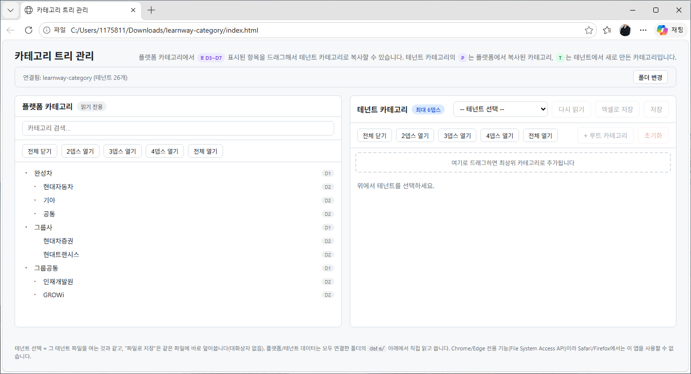
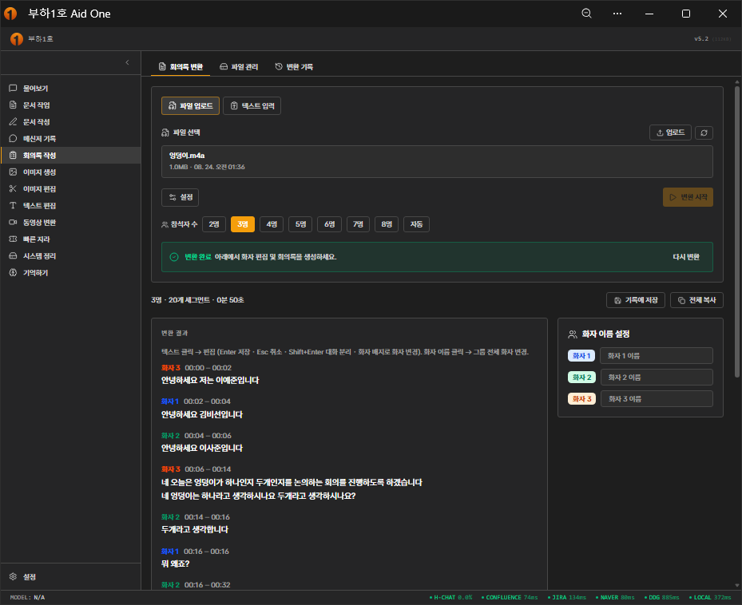
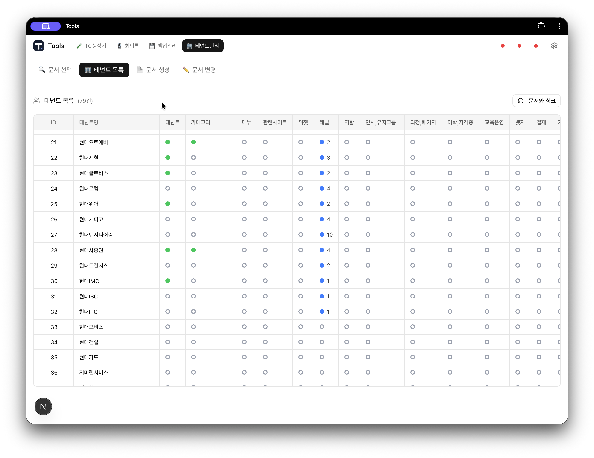
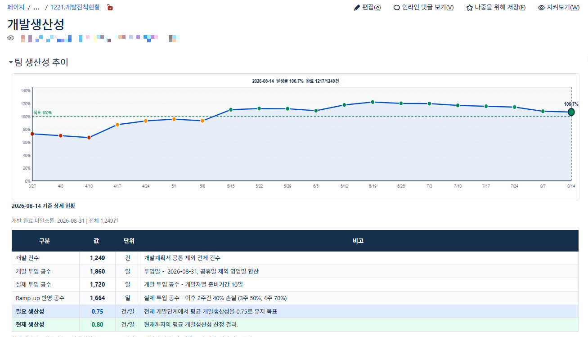
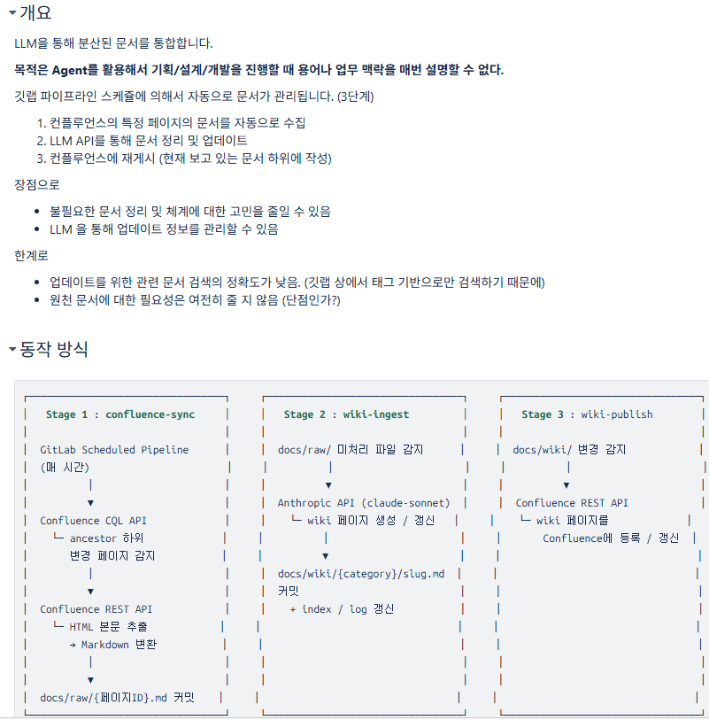

# 활용 사례

---

# 사내 배포를 고려한다면,

* 서버 방화벽 차단으로 설치가 불가능한 라이브러리가 많음
* 사내 Nexus에 등록 안된 것도 많고, OS 버전 문제도 많음
* 라이브러리 추가시 OS 빌드가 필요한 라이브러리는 최대한 회피
* sqlite 를 사용한다면 **drizzle orm + libsql** 추천
* 서버 배포는 Gitlab CI 활용
* 팀 내 공용 데이터 공간이 필요하다면 **One Drive** 고려

---

# 관리 | 커뮤니케이션

프로토타입, 복잡한 데이터 취합 등 커뮤니케이션을 돕는 도구 개발

---

# 관리 | 회의록 작성

화자 인식이 가능한 STT 엔진인 Whisper를 Python API로 사용
녹음 -> 변환 -> 회의록 자동 생성 파이프라인 구축

---

# 관리 | 컨플루언스 대시보드

컨플루언스 하위 문서를 하나씩 읽으면서 진행 상태 확인

---

# 관리 | 생산성 관리

개발계획서 기준 개발 현황은 주별로 추적하여 인별 생산성 확인

---

# 개발 | LLM Wiki 사용

컨플루언스의 내용을 AI가 검색할 수 있도록 로컬 임베딩 파이프라인
업무 시스템의 모든 기능을 조회할 수 있는 브레인

---

# 개발 | 생산성 향상

* DB-Entity-DAO-Model 연관관계 추적
* DB 튜닝 권고
* 코드 자동 리뷰
* BP 코드 기반 수정 개발 
* 다국어 처리 

---

# 개인 | 개인 비서

* 24시간 운영되는 PC에 Hermes Agent로 쟈비스 흉내
* 저렴한 VPC or 애플 맥 미니에서 구동
* 연산은 API 로 하고 정해진 프로그램만 구동하므로 저사양으로 운영 가능
* 텔레그램, Slack 연동을 기본으로 지원

---

# 개인 | 자동화

* 날씨 알림
* API 사용량 알림
* 메일 보관 처리
* 옵시디언 Clipping 처리
* 버스 알림

---

# 앱 찍어내기

## Next.js + Vercel + Supabase

* 앱 개발 스타터 팩
* 바이브 코딩으로 앱 출시까지 논스톱

---

# 트랜드 읽기

* 조쉬의 뉴스레터
* 한빛 데브레터
* 박재홍의 실리콘밸리
* 미쿡엔지니어의 실리콘밸리 인사이트
* GeekNews Weekly

---

# 감사합니다.